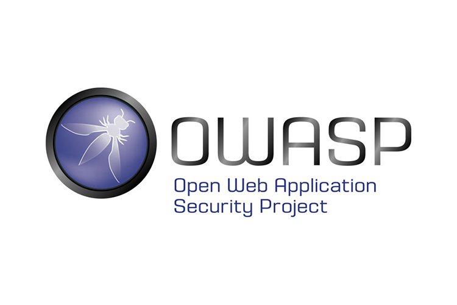

[//]: # (Topics:)
[//]: # (What is OWASP?)
[//]: # (OWASP Top 10)
[//]: # (Injection)
[//]: # (XSS)

# OWASP Lightning Talk
### by <a href="https://github.com/not-matthias" style="text-decoration:none; color: black">not-matthias</a>

---

## The OWASP Foundation

+++ 

### What is the OWASP Foundation?

- **O**pen **W**eb **A**pplication **S**ecurity **P**roject
- Free and open software security community
- Nonprofit organization
- Not driven by commercial interests

--- 

## The OWASP Top 10 List
 
### 

+++

### What is the OWASP Top 10 List?

- contains the most critical security risks to web applications
- aims to raise the awareness about application security
- identifies some of the most critical risks facing organizations

+++

### Contents

@ol

- Plain text list item
- Rich **markdown** list *item*
- Link [within](https://gitpitch.com) list item

@olend

 1. **Injection** 
<small> 2. Broken Authentication and Session Management</small> 
<small> 3. Sensitive Data Exposure</small> 
<small> 4. XML External Entity (XXE)</small> 
<small> 5. Broken Access Control</small> 
<small> 6. Security Misconfiguration</small> 
  7. **Cross-Site Scripting (XSS)** 
<small> 8. Insecure Deserialization</small> 
<small> 9. Using Components with Known Vulnerabilities</small> 
<small> 10. Insufficient Logging and Monitoring</small> 

--- 

# Injection

--- 

# XSS

